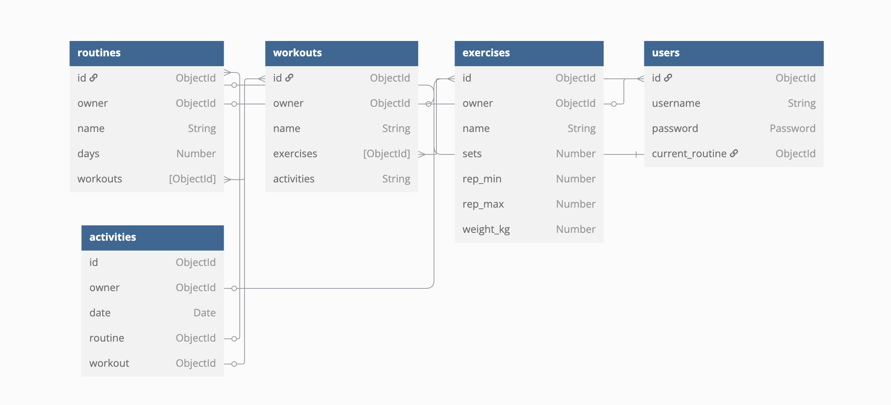

# GLog - [Gym-Log]

## Description

*GLog* is a full stack project I am currently developing. It is intended to help users plan and track their workout/exercise routines. After signing in or registering for an account, users can create their own `routines`, which are comprised of however many `workouts` they wish them to. In turn, `workouts` are comprised of individual `exercises`.

Users can edit these or create new ones whenever they like, and can edit `exercises` to raise things like weights.

Other initial features will include:
* Checking off when they have completed an exercise
* Logging when they have completed a workout
* Automatically seeing what their current routine is

## Technologies Used

*GLog* is a full-stack CRUD project, created with the following technologies using *Visual Studio*:

Back end:
* Django
* Python
* PostgreSQL

Front end:
* React
* JavaScript
* SCSS

## Development Notes

### Planning

Before starting on the back end of the app, I created an ERD table in *dbdiagram* to plan how data would be stored in my database:

In addition to users, I planned threem main apps: `exercises`, `workouts`, and `routines`. Routines are made up of workouts, workouts made up of exercises. In addition, I would have `activities` to store data on completed workouts.

With this ready, I started work on the back end in *Django* by creating apps for each of these. To begin with at least, all data is personal to individual users - a future version may allow users to share routines with other users. At the moment, this will work well for my purposes of tracking and managing my own routines, as well as those of a few of my friends! As such, I added authorisation so that users have to be the owner to be able to view the data they create. I created a custom `IsOwner` permission to allow for this.

I wanted to experiment more with many-to-many fields in *Django* - and this project has been great to do that so far. `workouts` can contain many `exercises`, which can also be included in many `workouts`. This is also the case with `workouts` and `routines`.

At every stage, all routes were extensively tested in *Postman* to ensure they were behaving as intended before getting started on the *React* front end.

**Next steps:**
* create relationships between data
* add sessions! research best way to store the workout data within
* create a set of dummy data

Planning the database took a lot of time - I realised that this initial plan would not function the way I desired, as storing data in arrays is not the best for SQL databases. So I did some research, read the documentation for Django, etc... So added some join tables instead